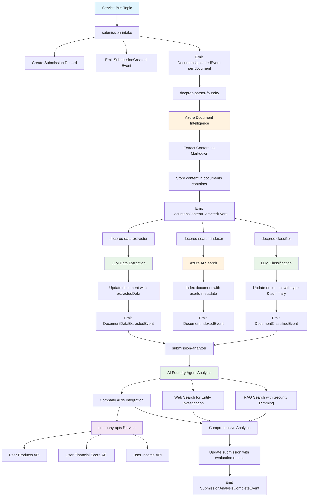
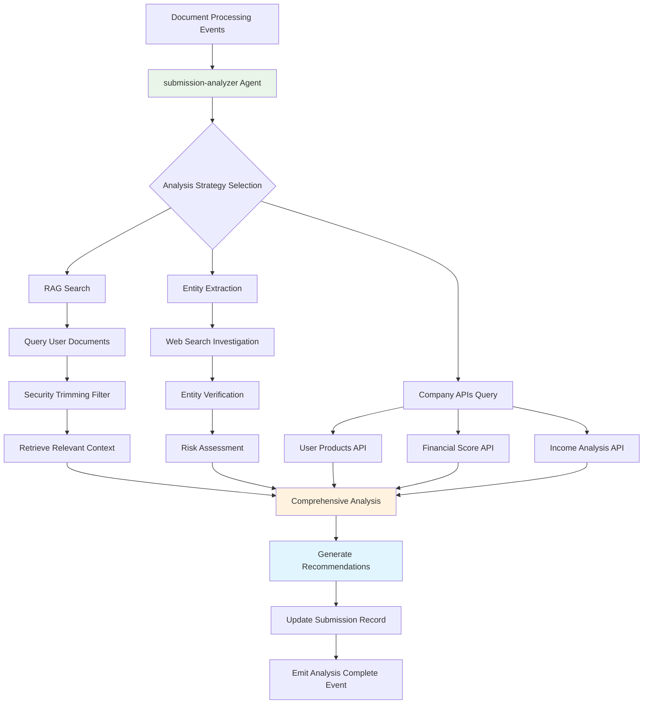

# Email Processing System Design

## Overview
This system processes incoming emails containing submission requests using AI to extract relevant information and generate potential responses. The system is built on Azure services with a focus on scalability, reliability, and maintainability.

## Process Flow
1. **Request Ingestion**: User submits a request via email or web form
   - **Email Trigger**: Traditional email-based submissions processed automatically
   - **Client Web Application**: Browser-based form allowing users to create submissions with:
     - Source email address entry
     - Message body composition
     - Multiple file attachments (0 or more)
     - Generates unique submission GUID
     - Stores files in Azure Blob Storage container (named with submission GUID)
     - Publishes event to Service Bus Topic with user ID, submission GUID, and document URLs
2. **Request Registration**: System generates unique identifier for the submission
3. **Content Storage**: Message body and attachments are stored for processing
5. **Document Analysis**: AI analyzes all submitted documents through a multi-step pipeline:
   - **Content Extraction**: Azure Document Intelligence converts documents to structured Markdown
   - **Classification & Summarization**: LLM classifies document types and generates summaries
   - **Search Indexing**: Content is indexed in Azure AI Search with metadata
   - **Data Extraction**: LLM extracts structured information based on document type
   - **Aggregation**: System tracks completion of all processing steps per document
5. **Submission Evaluation**: AI agent evaluates the complete submission to:
   - Identify missing information
   - Detect inconsistencies or errors
   - Generate evaluation results
6. **Operator Support**: AI-powered interface enables operators to:
   - Chat about user submissions and documents
   - Get recommended actions
   - Generate email responses

## Solution Architectures

### Architecture Option 1: Workflow Orchestration with Logic Apps
This approach leverages the orchestration capabilities of Azure Logic Apps to manage the entire process flow as a coordinated workflow.

**Characteristics:**
- Centralized orchestration through Logic Apps workflow
- Sequential and parallel processing controlled by the orchestrator
- Direct service-to-service communication without intermediate messaging
- Workflow state management handled by Logic Apps runtime
- Error handling and retry logic built into workflow definition
- Real-time processing with immediate feedback
- Simpler data model without intermediate state tracking

**Process Implementation:**
- Single Logic App workflow triggered by email/web form submission
- Workflow orchestrates all steps from content storage through final evaluation
- Direct calls to Azure services (Blob Storage, AI services, Cosmos DB, AI Search)
- Parallel document processing managed by workflow branching
- Synchronous processing with workflow waiting for completion of each step
- Final results available immediately upon workflow completion

### Architecture Option 2: Choreography with Event Sourcing
This approach uses event-driven architecture with event sourcing patterns to implement asynchronous processing through coordinated services.

**Characteristics:**
- Decoupled services communicating through events
- Event sourcing pattern using Cosmos DB as event store
- Change feed triggers for asynchronous processing
- Each service responds to relevant events and publishes new events
- Natural scalability and resilience through loose coupling
- Complete audit trail through event history
- Eventually consistent processing model

**Process Implementation:**
- Initial submission creates events in Cosmos DB event store
- Change feed triggers subsequent processing steps
- Each processing stage (storage, analysis, evaluation) operates independently
- Services listen to change feed for relevant events and process accordingly
- Document analysis services process events in parallel
- Final evaluation triggered when all document processing events are complete
- Event sourcing provides complete history and enables replay/recovery
- Asynchronous processing allows for high throughput and scalability

#### Detailed Architecture

**Event Store:** Cosmos DB container with Change Feed enabled
- Container: `events`
- Partition Key: `submissionId`
- Events are immutable and append-only

**Document Store:** Cosmos DB container for processed document results
- Container: `documents` 
- Partition Key: `submissionId` (groups documents by submission)
- Document ID: Generated GUID for each document record
- Type: `type` field to indicate document type and it is enum: `invoice`, `contract`, `bankStatement`, `submissionNotes`, `other`, 
- Schema:
  ```json
  {
    "id": "550e8400-e29b-41d4-a716-446655440000",
    "documentUrl": "https://storage.blob.core.windows.net/submission-guid/document1.pdf",
    "submissionId": "submission-guid",
    "userId": "user@example.com",
    "content": "Full text content extracted from document using Azure Document Intelligence...",
    "type": "invoice",
    "summary": "AI-generated summary of document content...",
    "extractedData": {
      "invoiceNumber": "INV-2025-001",
      "totalAmount": 1250.00,
      "currency": "USD",
      "dueDate": "2025-08-07",
      "vendor": "Acme Corp"
    },
    "firstProcessedAt": "2025-07-07T10:00:00Z",
    "lastProcessedAt": "2025-07-07T10:05:00Z"
  }
  ```
  
  Note: Cosmos DB automatically adds internal fields like `_rid`, `_self`, `_etag`, `_attachments`, and `_ts` which should be ignored by client applications when parsing the document model.

**Submission Store:** Cosmos DB container for submission records
- Container: `submissions`
- Partition Key: `submissionId`
- Schema:
  ```json
  {
    "id": "submission-guid",
    "submissionId": "submission-guid", 
    "userId": "user@example.com",
    "submittedAt": "2025-07-07T10:00:00Z",
    "documents": [
      {
        "documentUrl": "https://storage.blob.core.windows.net/submission-guid/document1.pdf",
        "processed": true,
        "type": "invoice"
      },
      {
        "documentUrl": "https://storage.blob.core.windows.net/submission-guid/document2.docx",
        "processed": true,
        "type": "contract"
      }
    ],
    "evaluationResults": {
      "completeness": 0.85,
      "recommendations": ["Request additional documentation for item X"],
      "issues": [],
      "analysisTimestamp": "2025-07-07T10:15:00Z"
    }
  }
  ```

**Service Architecture:**
1. **submission-intake**
   - Listens to Service Bus topic for new submissions
   - Creates submission record in submissions container
   - Emits `SubmissionCreated` event with document URLs
   - Emits `DocumentUploadedEvent` for each document

2. **docproc-parser-foundry**
   - Listens to Change Feed for `DocumentUploadedEvent`
   - Processes documents using Azure Document Intelligence to convert to Markdown
   - Stores content in documents container
   - Emits `DocumentContentExtractedEvent`

3. **docproc-classifier**
   - Listens to Change Feed for `DocumentContentExtractedEvent`
   - Uses LLM to classify document type and generate summary
   - Updates document record with type and summary
   - Emits `DocumentClassifiedEvent`

4. **docproc-search-indexer**
   - Listens to Change Feed for `DocumentContentExtractedEvent`
   - Ingests document content into Azure AI Search with metadata
   - Includes userId as filtering metadata for security trimming
   - Emits `DocumentIndexedEvent`

5. **docproc-data-extractor**
   - Listens to Change Feed for `DocumentContentExtractedEvent`
   - Uses LLM to extract structured information
   - Updates document record with extractedData
   - Emits `DocumentDataExtractedEvent`

6. **submission-analyzer**
   - Listens to Change Feed for `DocumentDataExtractedEvent` and `DocumentClassifiedEvent`
   - AI Foundry agent with advanced capabilities:
     - RAG search into Azure AI Search for user documents and previous conversations (with security trimming by userId)
     - Web search for investigating entities (e.g., invoice vendors, companies)
     - Integration with company-apis for internal business logic
   - Tracks completion of all document processing steps
   - Performs comprehensive AI analysis of complete submission
   - Updates submission record with evaluation results
   - Emits `SubmissionAnalysisCompleteEvent`

7. **company-apis**
   - REST API service providing business-specific tools for submission-analyzer
   - Mock data generation for demonstration purposes
   - Exposes internal company APIs as HTTP endpoints

#### Azure AI Search Index Schema

**Index Name:** `documents-index`

**Document Chunking Strategy:**
- Large documents are split into chunks of approximately 1000-1500 characters
- Chunks maintain context by including overlapping text (200-character overlap)
- Each chunk preserves metadata from the original document

**Index Fields:**

| Field Name | Type | Properties | Description |
|------------|------|------------|-------------|
| `id` | Edm.String | Key, Retrievable | Unique identifier for the chunk (format: `{documentId}_{chunkIndex}`) |
| `content` | Edm.String | Searchable, Retrievable | Text content of the document chunk |
| `contentVector` | Collection(Edm.Single) | Searchable | Vector embedding of the content for semantic search |
| `documentId` | Edm.String | Filterable, Retrievable | ID of the source document in Cosmos DB |
| `documentUrl` | Edm.String | Filterable, Retrievable | Azure Blob Storage URL of the original document |
| `submissionId` | Edm.String | Filterable, Retrievable | Submission ID (enables filtering by submission) |
| `userId` | Edm.String | Filterable, Retrievable | User ID for security trimming |
| `chunkIndex` | Edm.Int32 | Filterable, Retrievable | Sequential index of the chunk within the document |
| `timestamp` | Edm.DateTimeOffset | Filterable, Retrievable | When the document was indexed |

**Security Trimming Implementation:**
- All search queries include filter: `userId eq '{currentUserId}'`
- Ensures users only see their own document content
- Applied at query time for real-time access control

**Search Capabilities:**
- **Full-text search:** Traditional keyword-based search across content
- **Semantic search:** Vector-based similarity search using contentVector field
- **Filtered search:** Combine text/semantic search with metadata filters
- **Faceted search:** Group results by submissionId, etc.

**Example Index Document:**
```json
{
  "id": "550e8400-e29b-41d4-a716-446655440000_0",
  "content": "Invoice #INV-2025-001\n\nBill To: Acme Corporation\n123 Business St\nSeattle, WA 98101\n\nDate: July 15, 2025\nDue Date: August 14, 2025\n\nDescription: Professional consulting services for Q2 2025 project implementation...",
  "contentVector": [0.1234, -0.5678, 0.9012, ...],
  "documentId": "550e8400-e29b-41d4-a716-446655440000",
  "documentUrl": "https://storage.blob.core.windows.net/submissions/123e4567-e89b-12d3-a456-426614174000/invoice.pdf",
  "submissionId": "123e4567-e89b-12d3-a456-426614174000",
  "userId": "user@example.com",
  "chunkIndex": 0,
  "timestamp": "2025-07-15T10:30:00Z"
}
```

#### Event Formats

**SubmissionCreated**
```json
{
  "id": "uuid",
  "eventType": "SubmissionCreated",
  "submissionId": "submission-guid",
  "userId": "user@example.com",
  "timestamp": "2025-07-07T10:00:00Z",
  "data": {
    "documentUrls": [
      "https://storage.blob.core.windows.net/submission-guid/document1.pdf",
      "https://storage.blob.core.windows.net/submission-guid/document2.docx"
    ],
    "containerName": "submission-guid"
  }
}
```

**DocumentUploadedEvent**
```json
{
  "id": "uuid",
  "eventType": "DocumentUploadedEvent", 
  "submissionId": "submission-guid",
  "userId": "user@example.com",
  "timestamp": "2025-07-07T10:00:00Z",
  "data": {
    "documentUrl": "https://storage.blob.core.windows.net/submission-guid/document1.pdf",
    "documentId": "550e8400-e29b-41d4-a716-446655440000"
  }
}
```

**DocumentContentExtractedEvent**
```json
{
  "id": "uuid",
  "eventType": "DocumentContentExtractedEvent",
  "submissionId": "submission-guid",
  "userId": "user@example.com", 
  "timestamp": "2025-07-07T10:02:00Z",
  "data": {
    "documentUrl": "https://storage.blob.core.windows.net/submission-guid/document1.pdf",
    "documentId": "550e8400-e29b-41d4-a716-446655440000",
    "contentLength": 15000,
    "success": true
  }
}
```

**DocumentClassifiedEvent**
```json
{
  "id": "uuid",
  "eventType": "DocumentClassifiedEvent",
  "submissionId": "submission-guid",
  "userId": "user@example.com", 
  "timestamp": "2025-07-07T10:05:00Z",
  "data": {
    "documentUrl": "https://storage.blob.core.windows.net/submission-guid/document1.pdf",
    "documentId": "550e8400-e29b-41d4-a716-446655440000",
    "documentType": "invoice",
    "success": true
  }
}
```

**DocumentIndexedEvent**
```json
{
  "id": "uuid",
  "eventType": "DocumentIndexedEvent",
  "submissionId": "submission-guid",
  "userId": "user@example.com", 
  "timestamp": "2025-07-07T10:04:00Z",
  "data": {
    "documentUrl": "https://storage.blob.core.windows.net/submission-guid/document1.pdf",
    "documentId": "550e8400-e29b-41d4-a716-446655440000",
    "searchIndexId": "doc-uuid-in-search",
    "success": true
  }
}
```

**DocumentDataExtractedEvent**
```json
{
  "id": "uuid",
  "eventType": "DocumentDataExtractedEvent",
  "submissionId": "submission-guid",
  "userId": "user@example.com", 
  "timestamp": "2025-07-07T10:06:00Z",
  "data": {
    "documentUrl": "https://storage.blob.core.windows.net/submission-guid/document1.pdf",
    "documentId": "550e8400-e29b-41d4-a716-446655440000",
    "success": true
  }
}
```

**DocumentProcessedEvent**
```json
{
  "id": "uuid",
  "eventType": "DocumentProcessedEvent",
  "submissionId": "submission-guid",
  "userId": "user@example.com", 
  "timestamp": "2025-07-07T10:07:00Z",
  "data": {
    "documentUrl": "https://storage.blob.core.windows.net/submission-guid/document1.pdf",
    "processingStepsComplete": ["classification", "dataExtraction", "indexing"],
    "success": true
  }
}
```

**SubmissionAnalysisCompleteEvent**
```json
{
  "id": "uuid",
  "eventType": "SubmissionAnalysisCompleteEvent",
  "submissionId": "submission-guid",
  "userId": "user@example.com",
  "timestamp": "2025-07-07T10:15:00Z",
  "data": {
    "analysisResults": {
      "completeness": 0.85,
      "recommendations": ["Request additional documentation for item X"],
      "issues": []
    }
  }
}
```

#### Data Flow

```
Service Bus → submission-intake → SubmissionCreated Event
                                 ↓
                              DocumentUploadedEvent (per document)
                                 ↓
                           docproc-parser-foundry
                                 ↓
                         DocumentContentExtractedEvent
                                 ↓
              ┌──────────────────┼──────────────────┐
              ↓                  ↓                  ↓
    docproc-classifier  docproc-search-indexer  docproc-data-extractor
              ↓                  ↓                  ↓
  DocumentClassifiedEvent  DocumentIndexedEvent  DocumentDataExtractedEvent
              ↓                                   ↓
              └─────────────→ submission-analyzer ←┘
                                 ↓
                      SubmissionAnalysisCompleteEvent
```

#### Process Flow Diagram



#### Error Handling and Resilience

- **Retry Logic:** Each service implements exponential backoff for failed operations
- **Dead Letter Handling:** Failed events after max retries go to dead letter queue
- **Idempotency:** All event handlers are idempotent using event IDs
- **Compensation:** Event sourcing enables replay and compensation for failed workflows
- **Monitoring:** Change Feed provides built-in monitoring of event processing

### Architecture Comparison

**Workflow Orchestration with Logic Apps:**
- ✅ Built-in monitoring and error handling
- ✅ Visual workflow and progress tracking
- ✅ Simpler to understand and debug
- ✅ Azure-native tooling
- ❌ Azure-specific, less flexibility

**Choreography with Event Sourcing:**
- ✅ Code-first Python approach
- ✅ Multi-cloud portability
- ✅ Complete audit trail
- ✅ Fine-grained control
- ❌ Complex to write and troubleshoot

**Key Trade-off:** Simplicity vs. Control

## Company APIs Service

The Company APIs service provides business-specific functionality as HTTP endpoints that can be consumed by the submission-analyzer AI agent. This service generates mock data for demonstration purposes and exposes internal company information through RESTful APIs.

### API Endpoints

#### 1. User Products API

**Endpoint:** `GET /api/v1/users/{userId}/products`

**Description:** Retrieves a list of products and services that the user is currently subscribed to or using.

**Parameters:**
- `userId` (path parameter, required): The user's unique identifier (email address)

**Response Schema:**
```json
{
  "userId": "string",
  "products": [
    {
      "productId": "string",
      "productName": "string",
      "productType": "string",
      "subscriptionStatus": "string",
      "subscriptionDate": "string",
      "monthlyFee": "number",
      "features": ["string"]
    }
  ],
  "totalActiveSubscriptions": "number",
  "totalMonthlyFees": "number"
}
```

**Example Request:**
```
GET /api/v1/users/john.doe@example.com/products
```

**Example Response:**
```json
{
  "userId": "john.doe@example.com",
  "products": [
    {
      "productId": "PRD-001",
      "productName": "Premium Business Account",
      "productType": "banking",
      "subscriptionStatus": "active",
      "subscriptionDate": "2024-01-15T00:00:00Z",
      "monthlyFee": 29.99,
      "features": ["unlimited_transactions", "priority_support", "advanced_analytics"]
    },
    {
      "productId": "PRD-002",
      "productName": "Investment Portfolio Management",
      "productType": "investment",
      "subscriptionStatus": "active",
      "subscriptionDate": "2024-03-20T00:00:00Z",
      "monthlyFee": 49.99,
      "features": ["portfolio_tracking", "risk_assessment", "automated_rebalancing"]
    }
  ],
  "totalActiveSubscriptions": 2,
  "totalMonthlyFees": 79.98
}
```

#### 2. User Financial Score API

**Endpoint:** `GET /api/v1/users/{userId}/financial-score`

**Description:** Returns the user's financial score based on various scoring methodologies.

**Parameters:**
- `userId` (path parameter, required): The user's unique identifier (email address)
- `scoreType` (query parameter, optional): Type of financial score to retrieve. Defaults to "composite"
  - `composite`: Overall financial health score (default)
  - `creditworthiness`: Credit-based scoring
  - `liquidity`: Cash flow and liquidity assessment
  - `stability`: Income and expense stability
  - `growth`: Financial growth trajectory

**Response Schema:**
```json
{
  "userId": "string",
  "scoreType": "string",
  "score": "number",
  "maxScore": "number",
  "scoreDate": "string",
  "factors": [
    {
      "factor": "string",
      "weight": "number",
      "score": "number",
      "description": "string"
    }
  ],
  "recommendations": ["string"]
}
```

**Example Request:**
```
GET /api/v1/users/john.doe@example.com/financial-score?scoreType=composite
```

**Example Response:**
```json
{
  "userId": "john.doe@example.com",
  "scoreType": "composite",
  "score": 82,
  "maxScore": 100,
  "scoreDate": "2025-07-11T00:00:00Z",
  "factors": [
    {
      "factor": "payment_history",
      "weight": 0.35,
      "score": 88,
      "description": "Consistent on-time payments with minimal late fees"
    },
    {
      "factor": "debt_to_income_ratio",
      "weight": 0.25,
      "score": 75,
      "description": "Moderate debt levels relative to income"
    },
    {
      "factor": "account_age",
      "weight": 0.20,
      "score": 90,
      "description": "Long-standing customer with mature account history"
    },
    {
      "factor": "cash_reserves",
      "weight": 0.20,
      "score": 78,
      "description": "Adequate emergency fund and savings balance"
    }
  ],
  "recommendations": [
    "Consider increasing monthly savings contributions",
    "Explore debt consolidation options to improve debt-to-income ratio"
  ]
}
```

#### 3. User Income API

**Endpoint:** `GET /api/v1/users/{userId}/income`

**Description:** Returns aggregated income data for the user over a specified time period.

**Parameters:**
- `userId` (path parameter, required): The user's unique identifier (email address)
- `startDate` (query parameter, required): Start date for income period (ISO 8601 format)
- `endDate` (query parameter, required): End date for income period (ISO 8601 format)
- `granularity` (query parameter, optional): Aggregation granularity. Defaults to "monthly"
  - `daily`: Daily income aggregation
  - `weekly`: Weekly income aggregation
  - `monthly`: Monthly income aggregation (default)
  - `yearly`: Yearly income aggregation

**Response Schema:**
```json
{
  "userId": "string",
  "startDate": "string",
  "endDate": "string",
  "granularity": "string",
  "totalIncome": "number",
  "averageIncome": "number",
  "incomeEntries": [
    {
      "period": "string",
      "totalAmount": "number",
      "sources": [
        {
          "sourceType": "string",
          "sourceName": "string",
          "amount": "number",
          "frequency": "string"
        }
      ]
    }
  ],
  "incomeGrowth": "number",
  "incomeStability": "number"
}
```

**Example Request:**
```
GET /api/v1/users/john.doe@example.com/income?startDate=2025-01-01&endDate=2025-07-31&granularity=monthly
```

**Example Response:**
```json
{
  "userId": "john.doe@example.com",
  "startDate": "2025-01-01T00:00:00Z",
  "endDate": "2025-07-31T23:59:59Z",
  "granularity": "monthly",
  "totalIncome": 42000.00,
  "averageIncome": 6000.00,
  "incomeEntries": [
    {
      "period": "2025-01",
      "totalAmount": 6200.00,
      "sources": [
        {
          "sourceType": "salary",
          "sourceName": "Primary Employer",
          "amount": 5500.00,
          "frequency": "monthly"
        },
        {
          "sourceType": "freelance",
          "sourceName": "Consulting Work",
          "amount": 700.00,
          "frequency": "irregular"
        }
      ]
    },
    {
      "period": "2025-02",
      "totalAmount": 5800.00,
      "sources": [
        {
          "sourceType": "salary",
          "sourceName": "Primary Employer",
          "amount": 5500.00,
          "frequency": "monthly"
        },
        {
          "sourceType": "investment",
          "sourceName": "Dividend Income",
          "amount": 300.00,
          "frequency": "quarterly"
        }
      ]
    }
  ],
  "incomeGrowth": 0.05,
  "incomeStability": 0.88
}
```

### Error Handling

All endpoints follow consistent error response format:

```json
{
  "error": {
    "code": "string",
    "message": "string",
    "details": "string"
  }
}
```

Common error codes:
- `USER_NOT_FOUND`: User ID does not exist in the system
- `INVALID_DATE_RANGE`: Invalid or malformed date parameters
- `INVALID_SCORE_TYPE`: Unsupported financial score type
- `INVALID_GRANULARITY`: Unsupported aggregation granularity
- `INTERNAL_ERROR`: Server-side processing error

### Security

- All endpoints require authentication via Azure AD Bearer token
- User context is validated to ensure users can only access their own data
- Rate limiting applied per user to prevent abuse
- Input validation and sanitization on all parameters

## AI Foundry Agent Architecture

The submission-analyzer service implements an AI Foundry agent with sophisticated capabilities for analyzing user submissions. The agent combines multiple AI techniques and data sources to provide comprehensive analysis and recommendations.

### Agent Capabilities

#### 1. RAG (Retrieval-Augmented Generation) with Security Trimming

**Purpose:** Search and retrieve relevant information from the user's document history and previous conversations.

**Implementation:**
- Queries Azure AI Search `documents-index` containing all user document chunks
- Applies security trimming by filtering results where `userId == currentUser`
- Supports both full-text and semantic search using content vectors
- Retrieves contextually relevant document chunks with source metadata
- Provides document context to the AI agent for informed decision making

**Search Query Examples:**
```
// Semantic search with security trimming
{
  "search": "invoice payment terms",
  "vector": { "value": [0.1, 0.2, ...], "fields": "contentVector" },
  "filter": "userId eq 'user@example.com'",
  "select": "content,documentUrl,submissionId,documentType,chunkIndex"
}

// Filtered search by submission
{
  "search": "*",
  "filter": "userId eq 'user@example.com' and submissionId eq '123e4567-e89b-12d3-a456-426614174000'",
  "select": "content,documentUrl,submissionId"
}
```

**Retrieved Context Format:**
- Document chunk content with source attribution
- Metadata including documentUrl, submissionId
- Chunk index for reconstructing document structure if needed

**Security Features:**
- Row-level security through userId filtering
- Encrypted search queries and results
- Audit logging of all search operations
- Access control validation for each query

#### 2. Web Search for Entity Investigation

**Purpose:** Investigate external entities mentioned in documents (e.g., invoice vendors, business partners, organizations).

**Implementation:**
- Integrates with Azure Cognitive Search Web API or Bing Search API
- Automatically extracts entity names from documents (companies, vendors, organizations)
- Performs targeted web searches to gather public information
- Analyzes search results to identify potential risks or opportunities

**Use Cases:**
- Vendor verification and reputation checking
- Business legitimacy validation
- Risk assessment for new business relationships
- Market intelligence gathering

#### 3. Company APIs Integration

**Purpose:** Access internal company data and business logic through standardized APIs.

**Implementation:**
- HTTP client integration with company-apis service
- Automatic user context propagation for personalized data retrieval
- Structured data integration into agent reasoning process
- Error handling and fallback mechanisms

**Available Tools:**
- User product portfolio analysis
- Financial health assessment
- Income trend analysis
- Risk scoring and profiling

### Agent Workflow



### Analysis Outputs

The AI agent generates comprehensive analysis results including:

1. **Completeness Assessment**
   - Document coverage analysis
   - Missing information identification
   - Compliance requirement checking

2. **Risk Analysis**
   - Vendor/entity risk evaluation
   - Financial risk assessment
   - Operational risk identification

3. **Recommendation Generation**
   - Next steps for submission processing
   - Additional documentation requirements
   - Potential opportunities or concerns

4. **Compliance Validation**
   - Regulatory requirement verification
   - Policy adherence checking
   - Audit trail generation

## Service Scaling and High Availability

### Document Processing Service Scaling

The document processing services (docproc-parser-foundry, docproc-classifier, etc.) are designed to scale horizontally to handle increased document processing load. The architecture supports multiple replicas of each service processing events in parallel.

#### Change Feed Distribution Strategy

**FeedRange-Based Parallelization:**
- Each Cosmos DB container is internally partitioned into physical partitions
- Each physical partition has a corresponding FeedRange that represents a range of partition keys
- Multiple service replicas can process different FeedRanges simultaneously
- No overlap between FeedRanges ensures no duplicate processing

**Scaling Architecture:**
```
┌─────────────────────────────────────────────────────────────┐
│ Cosmos DB Container (events)                                │
│ ┌─────────────┬─────────────┬─────────────┬─────────────┐   │
│ │ FeedRange 0 │ FeedRange 1 │ FeedRange 2 │ FeedRange 3 │   │
│ │ Partition   │ Partition   │ Partition   │ Partition   │   │
│ │ 0000-3FFF   │ 4000-7FFF   │ 8000-BFFF   │ C000-FFFF   │   │
│ └─────────────┴─────────────┴─────────────┴─────────────┘   │
└─────────────────────────────────────────────────────────────┘
         │              │              │              │
         ▼              ▼              ▼              ▼
┌─────────────┐ ┌─────────────┐ ┌─────────────┐ ┌─────────────┐
│   Replica   │ │   Replica   │ │   Replica   │ │   Replica   │
│      A      │ │      B      │ │      C      │ │      D      │
│             │ │             │ │             │ │             │
│ Processes   │ │ Processes   │ │ Processes   │ │ Processes   │
│ FeedRange 0 │ │ FeedRange 1 │ │ FeedRange 2 │ │ FeedRange 3 │
└─────────────┘ └─────────────┘ └─────────────┘ └─────────────┘
```

#### Coordination and Leadership

**Leader Election Pattern:**
- One replica becomes the "leader" responsible for FeedRange assignment coordination
- Leader maintains mapping of replicas to FeedRanges in Azure Table Storage
- Leader monitors replica health through heartbeat mechanism
- Automatic rebalancing when replicas join or leave the cluster

**Assignment Distribution:**
```
Azure Table Storage - FeedRange Assignments
┌──────────────────────────────────────────────────────────┐
│ Assignments Table                                        │
│ ┌─────────────┬─────────────────────────────────────────┐ │
│ │ Replica ID  │ Assigned FeedRanges                     │ │
│ ├─────────────┼─────────────────────────────────────────┤ │
│ │ replica-a   │ ["feedrange-0", "feedrange-1"]          │ │
│ │ replica-b   │ ["feedrange-2"]                         │ │
│ │ replica-c   │ ["feedrange-3"]                         │ │
│ └─────────────┴─────────────────────────────────────────┘ │
│                                                          │
│ Replicas Table (Heartbeats)                             │
│ ┌─────────────┬─────────────────────────────────────────┐ │
│ │ Replica ID  │ Last Heartbeat                          │ │
│ ├─────────────┼─────────────────────────────────────────┤ │
│ │ replica-a   │ 2025-07-09T10:15:30Z                    │ │
│ │ replica-b   │ 2025-07-09T10:15:28Z                    │ │
│ │ replica-c   │ 2025-07-09T10:15:32Z                    │ │
│ └─────────────┴─────────────────────────────────────────┘ │
└──────────────────────────────────────────────────────────┘
```

#### Scaling Scenarios

**Scale Up (2→4 replicas):**
1. New replicas start and register with heartbeat system
2. Leader detects additional active replicas
3. Leader redistributes FeedRanges across 4 replicas instead of 2
4. Each replica polls for updated assignments and begins processing new FeedRanges

**Scale Down (4→2 replicas):**
1. 2 replicas are terminated (stop sending heartbeats)
2. Leader detects missing heartbeats after timeout period
3. Leader reassigns orphaned FeedRanges to remaining 2 replicas
4. Remaining replicas pick up additional FeedRanges automatically

**Leader Failure:**
1. Current leader stops sending heartbeats
2. Other replicas detect leader absence after timeout
3. New leader election using atomic operations in Table Storage
4. New leader takes over assignment coordination seamlessly

#### Performance Characteristics

**Throughput:** Linear scaling with number of replicas (limited by physical partitions)
**Latency:** No coordination overhead during normal processing
**Availability:** Service continues operating even during leader transitions
**Consistency:** Each document processed exactly once due to FeedRange isolation

#### MVP vs Production

**MVP Implementation:**
- Single replica deployment for simplicity
- Continuation tokens stored in Azure Table Storage for restart resilience
- Manual scaling by adjusting replica count

**Production Implementation:**
- Multiple replicas with automatic FeedRange distribution
- Leader election and coordination via Azure Table Storage
- Container orchestration (Kubernetes, Container Apps) for automatic scaling
- Health checks and monitoring for replica management
