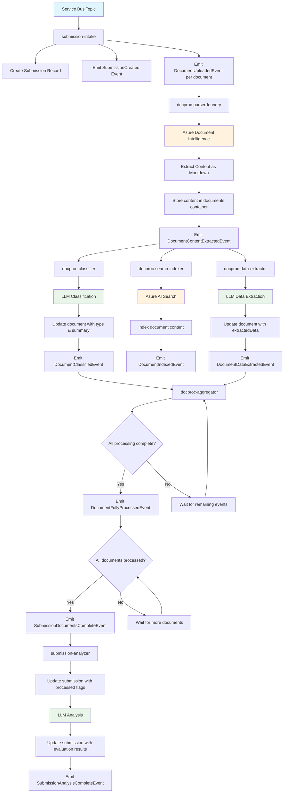

# Email Processing System Design

## Overview
This system processes incoming emails containing submission requests using AI to extract relevant information and generate potential responses. The system is built on Azure services with a focus on scalability, reliability, and maintainability.

## Process Flow
1. **Request Ingestion**: User submits a request via email or web form
   - **Email Trigger**: Traditional email-based submissions processed automatically
   - **Client Web Application**: Browser-based form allowing users to create submissions with:
     - Source email address entry
     - Message body composition
     - Multiple file attachments (0 or more)
     - Generates unique submission GUID
     - Stores files in Azure Blob Storage container (named with submission GUID)
     - Publishes event to Service Bus Topic with user ID, submission GUID, and document URLs
2. **Request Registration**: System generates unique identifier for the submission
3. **Content Storage**: Message body and attachments are stored for processing
5. **Document Analysis**: AI analyzes all submitted documents through a multi-step pipeline:
   - **Content Extraction**: Azure Document Intelligence converts documents to structured Markdown
   - **Classification & Summarization**: LLM classifies document types and generates summaries
   - **Search Indexing**: Content is indexed in Azure AI Search with metadata
   - **Data Extraction**: LLM extracts structured information based on document type
   - **Aggregation**: System tracks completion of all processing steps per document
5. **Submission Evaluation**: AI agent evaluates the complete submission to:
   - Identify missing information
   - Detect inconsistencies or errors
   - Generate evaluation results
6. **Operator Support**: AI-powered interface enables operators to:
   - Chat about user submissions and documents
   - Get recommended actions
   - Generate email responses

## Solution Architectures

### Architecture Option 1: Workflow Orchestration with Logic Apps
This approach leverages the orchestration capabilities of Azure Logic Apps to manage the entire process flow as a coordinated workflow.

**Characteristics:**
- Centralized orchestration through Logic Apps workflow
- Sequential and parallel processing controlled by the orchestrator
- Direct service-to-service communication without intermediate messaging
- Workflow state management handled by Logic Apps runtime
- Error handling and retry logic built into workflow definition
- Real-time processing with immediate feedback
- Simpler data model without intermediate state tracking

**Process Implementation:**
- Single Logic App workflow triggered by email/web form submission
- Workflow orchestrates all steps from content storage through final evaluation
- Direct calls to Azure services (Blob Storage, AI services, Cosmos DB, AI Search)
- Parallel document processing managed by workflow branching
- Synchronous processing with workflow waiting for completion of each step
- Final results available immediately upon workflow completion

### Architecture Option 2: Choreography with Event Sourcing
This approach uses event-driven architecture with event sourcing patterns to implement asynchronous processing through coordinated services.

**Characteristics:**
- Decoupled services communicating through events
- Event sourcing pattern using Cosmos DB as event store
- Change feed triggers for asynchronous processing
- Each service responds to relevant events and publishes new events
- Natural scalability and resilience through loose coupling
- Complete audit trail through event history
- Eventually consistent processing model

**Process Implementation:**
- Initial submission creates events in Cosmos DB event store
- Change feed triggers subsequent processing steps
- Each processing stage (storage, analysis, evaluation) operates independently
- Services listen to change feed for relevant events and process accordingly
- Document analysis services process events in parallel
- Final evaluation triggered when all document processing events are complete
- Event sourcing provides complete history and enables replay/recovery
- Asynchronous processing allows for high throughput and scalability

#### Detailed Architecture

**Event Store:** Cosmos DB container with Change Feed enabled
- Container: `events`
- Partition Key: `submissionId`
- Events are immutable and append-only

**Document Store:** Cosmos DB container for processed document results
- Container: `documents` 
- Partition Key: `submissionId` (groups documents by submission)
- Document ID: Generated GUID for each document record
- Type: `type` field to indicate document type and it is enum: `invoice`, `contract`, `bankStatement`, `submissionNotes`, `other`, 
- Schema:
  ```json
  {
    "id": "550e8400-e29b-41d4-a716-446655440000",
    "documentUrl": "https://storage.blob.core.windows.net/submission-guid/document1.pdf",
    "submissionId": "submission-guid",
    "userId": "user@example.com",
    "content": "Full text content extracted from document using Azure Document Intelligence...",
    "type": "invoice",
    "summary": "AI-generated summary of document content...",
    "extractedData": {
      "invoiceNumber": "INV-2025-001",
      "amount": 1250.00,
      "currency": "USD",
      "dueDate": "2025-08-07",
      "vendor": "Acme Corp"
    },
    "firstProcessedAt": "2025-07-07T10:00:00Z",
    "lastProcessedAt": "2025-07-07T10:05:00Z"
  }
  ```
  
  Note: Cosmos DB automatically adds internal fields like `_rid`, `_self`, `_etag`, `_attachments`, and `_ts` which should be ignored by client applications when parsing the document model.

**Submission Store:** Cosmos DB container for submission records
- Container: `submissions`
- Partition Key: `submissionId`
- Schema:
  ```json
  {
    "id": "submission-guid",
    "submissionId": "submission-guid", 
    "userId": "user@example.com",
    "submittedAt": "2025-07-07T10:00:00Z",
    "documents": [
      {
        "documentUrl": "https://storage.blob.core.windows.net/submission-guid/document1.pdf",
        "processed": true,
        "type": "invoice"
      },
      {
        "documentUrl": "https://storage.blob.core.windows.net/submission-guid/document2.docx",
        "processed": true,
        "type": "contract"
      }
    ],
    "evaluationResults": {
      "completeness": 0.85,
      "recommendations": ["Request additional documentation for item X"],
      "issues": [],
      "analysisTimestamp": "2025-07-07T10:15:00Z"
    }
  }
  ```

**Service Architecture:**
1. **submission-intake**
   - Listens to Service Bus topic for new submissions
   - Creates submission record in submissions container
   - Emits `SubmissionCreated` event with document URLs
   - Emits `DocumentUploadedEvent` for each document

2. **docproc-parser-foundry**
   - Listens to Change Feed for `DocumentUploadedEvent`
   - Processes documents using Azure Document Intelligence to convert to Markdown
   - Stores content in documents container
   - Emits `DocumentContentExtractedEvent`

3. **docproc-classifier**
   - Listens to Change Feed for `DocumentContentExtractedEvent`
   - Uses LLM to classify document type and generate summary
   - Updates document record with type and summary
   - Emits `DocumentClassifiedEvent`

4. **docproc-search-indexer**
   - Listens to Change Feed for `DocumentContentExtractedEvent`
   - Ingests document content into Azure AI Search with metadata
   - Emits `DocumentIndexedEvent`

5. **docproc-data-extractor**
   - Listens to Change Feed for `DocumentContentExtractedEvent`
   - Uses LLM to extract structured information
   - Updates document record with extractedData
   - Emits `DocumentDataExtractedEvent`

6. **docproc-aggregator**
   - Listens to Change Feed for `DocumentClassifiedEvent` and `DocumentDataExtractedEvent`
   - Tracks completion of classification and data extraction for each document
   - Emits `DocumentFullyProcessedEvent` when both are complete
   - Emits `SubmissionDocumentsCompleteEvent` when all documents in submission are processed

7. **submission-analyzer**
   - Listens to Change Feed for `SubmissionDocumentsCompleteEvent`
   - Updates submission record with processed flags and types for each document
   - Performs final AI analysis of complete submission
   - Updates submission record with evaluation results
   - Emits `SubmissionAnalysisCompleteEvent`

#### Event Formats

**SubmissionCreated**
```json
{
  "id": "uuid",
  "eventType": "SubmissionCreated",
  "submissionId": "submission-guid",
  "userId": "user@example.com",
  "timestamp": "2025-07-07T10:00:00Z",
  "data": {
    "documentUrls": [
      "https://storage.blob.core.windows.net/submission-guid/document1.pdf",
      "https://storage.blob.core.windows.net/submission-guid/document2.docx"
    ],
    "containerName": "submission-guid"
  }
}
```

**DocumentUploadedEvent**
```json
{
  "id": "uuid",
  "eventType": "DocumentUploadedEvent", 
  "submissionId": "submission-guid",
  "userId": "user@example.com",
  "timestamp": "2025-07-07T10:00:00Z",
  "data": {
    "documentUrl": "https://storage.blob.core.windows.net/submission-guid/document1.pdf",
    "documentId": "550e8400-e29b-41d4-a716-446655440000"
  }
}
```

**DocumentContentExtractedEvent**
```json
{
  "id": "uuid",
  "eventType": "DocumentContentExtractedEvent",
  "submissionId": "submission-guid",
  "userId": "user@example.com", 
  "timestamp": "2025-07-07T10:02:00Z",
  "data": {
    "documentUrl": "https://storage.blob.core.windows.net/submission-guid/document1.pdf",
    "documentId": "550e8400-e29b-41d4-a716-446655440000",
    "contentLength": 15000,
    "success": true
  }
}
```

**DocumentClassifiedEvent**
```json
{
  "id": "uuid",
  "eventType": "DocumentClassifiedEvent",
  "submissionId": "submission-guid",
  "userId": "user@example.com", 
  "timestamp": "2025-07-07T10:05:00Z",
  "data": {
    "documentUrl": "https://storage.blob.core.windows.net/submission-guid/document1.pdf",
    "documentId": "550e8400-e29b-41d4-a716-446655440000",
    "documentType": "invoice",
    "success": true
  }
}
```

**DocumentIndexedEvent**
```json
{
  "id": "uuid",
  "eventType": "DocumentIndexedEvent",
  "submissionId": "submission-guid",
  "userId": "user@example.com", 
  "timestamp": "2025-07-07T10:04:00Z",
  "data": {
    "documentUrl": "https://storage.blob.core.windows.net/submission-guid/document1.pdf",
    "documentId": "550e8400-e29b-41d4-a716-446655440000",
    "searchIndexId": "doc-uuid-in-search",
    "success": true
  }
}
```

**DocumentDataExtractedEvent**
```json
{
  "id": "uuid",
  "eventType": "DocumentDataExtractedEvent",
  "submissionId": "submission-guid",
  "userId": "user@example.com", 
  "timestamp": "2025-07-07T10:06:00Z",
  "data": {
    "documentUrl": "https://storage.blob.core.windows.net/submission-guid/document1.pdf",
    "documentId": "550e8400-e29b-41d4-a716-446655440000",
    "success": true
  }
}
```

**DocumentProcessedEvent**
```json
{
  "id": "uuid",
  "eventType": "DocumentProcessedEvent",
  "submissionId": "submission-guid",
  "userId": "user@example.com", 
  "timestamp": "2025-07-07T10:07:00Z",
  "data": {
    "documentUrl": "https://storage.blob.core.windows.net/submission-guid/document1.pdf",
    "processingStepsComplete": ["classification", "dataExtraction"],
    "success": true
  }
}
```

**DocumentFullyProcessedEvent**
```json
{
  "id": "uuid",
  "eventType": "DocumentFullyProcessedEvent",
  "submissionId": "submission-guid",
  "userId": "user@example.com",
  "timestamp": "2025-07-07T10:08:00Z",
  "data": {
    "documentUrl": "https://storage.blob.core.windows.net/submission-guid/document1.pdf",
    "allProcessingComplete": true,
    "documentType": "invoice"
  }
}
```

**SubmissionDocumentsCompleteEvent**
```json
{
  "id": "uuid",
  "eventType": "SubmissionDocumentsCompleteEvent",
  "submissionId": "submission-guid",
  "userId": "user@example.com",
  "timestamp": "2025-07-07T10:10:00Z",
  "data": {
    "totalDocuments": 2,
    "processedDocuments": 2,
    "documentTypes": ["invoice", "contract"]
  }
}
```

**SubmissionAnalysisCompleteEvent**
```json
{
  "id": "uuid",
  "eventType": "SubmissionAnalysisCompleteEvent",
  "submissionId": "submission-guid",
  "userId": "user@example.com",
  "timestamp": "2025-07-07T10:15:00Z",
  "data": {
    "analysisResults": {
      "completeness": 0.85,
      "recommendations": ["Request additional documentation for item X"],
      "issues": []
    }
  }
}
```

#### Data Flow

```
Service Bus → submission-intake → SubmissionCreated Event
                                 ↓
                              DocumentUploadedEvent (per document)
                                 ↓
                           docproc-parser-foundry
                                 ↓
                         DocumentContentExtractedEvent
                                 ↓
              ┌──────────────────┼──────────────────┐
              ↓                  ↓                  ↓
    docproc-classifier  docproc-search-indexer  docproc-data-extractor
              ↓                  ↓                  ↓
  DocumentClassifiedEvent  DocumentIndexedEvent  DocumentDataExtractedEvent
              ↓                                   ↓
              └─────────────→ docproc-aggregator ←┘
                                 ↓
                        DocumentFullyProcessedEvent
                                 ↓
                      SubmissionDocumentsCompleteEvent
                                 ↓
                          submission-analyzer
                                 ↓
                      SubmissionAnalysisCompleteEvent
```

#### Process Flow Diagram



#### Error Handling and Resilience

- **Retry Logic:** Each service implements exponential backoff for failed operations
- **Dead Letter Handling:** Failed events after max retries go to dead letter queue
- **Idempotency:** All event handlers are idempotent using event IDs
- **Compensation:** Event sourcing enables replay and compensation for failed workflows
- **Monitoring:** Change Feed provides built-in monitoring of event processing

### Architecture Comparison

**Workflow Orchestration with Logic Apps:**
- ✅ Built-in monitoring and error handling
- ✅ Visual workflow and progress tracking
- ✅ Simpler to understand and debug
- ✅ Azure-native tooling
- ❌ Azure-specific, less flexibility

**Choreography with Event Sourcing:**
- ✅ Code-first Python approach
- ✅ Multi-cloud portability
- ✅ Complete audit trail
- ✅ Fine-grained control
- ❌ Complex to write and troubleshoot

**Key Trade-off:** Simplicity vs. Control

## Service Scaling and High Availability

### Document Processing Service Scaling

The document processing services (docproc-parser-foundry, docproc-classifier, etc.) are designed to scale horizontally to handle increased document processing load. The architecture supports multiple replicas of each service processing events in parallel.

#### Change Feed Distribution Strategy

**FeedRange-Based Parallelization:**
- Each Cosmos DB container is internally partitioned into physical partitions
- Each physical partition has a corresponding FeedRange that represents a range of partition keys
- Multiple service replicas can process different FeedRanges simultaneously
- No overlap between FeedRanges ensures no duplicate processing

**Scaling Architecture:**
```
┌─────────────────────────────────────────────────────────────┐
│ Cosmos DB Container (events)                                │
│ ┌─────────────┬─────────────┬─────────────┬─────────────┐   │
│ │ FeedRange 0 │ FeedRange 1 │ FeedRange 2 │ FeedRange 3 │   │
│ │ Partition   │ Partition   │ Partition   │ Partition   │   │
│ │ 0000-3FFF   │ 4000-7FFF   │ 8000-BFFF   │ C000-FFFF   │   │
│ └─────────────┴─────────────┴─────────────┴─────────────┘   │
└─────────────────────────────────────────────────────────────┘
         │              │              │              │
         ▼              ▼              ▼              ▼
┌─────────────┐ ┌─────────────┐ ┌─────────────┐ ┌─────────────┐
│   Replica   │ │   Replica   │ │   Replica   │ │   Replica   │
│      A      │ │      B      │ │      C      │ │      D      │
│             │ │             │ │             │ │             │
│ Processes   │ │ Processes   │ │ Processes   │ │ Processes   │
│ FeedRange 0 │ │ FeedRange 1 │ │ FeedRange 2 │ │ FeedRange 3 │
└─────────────┘ └─────────────┘ └─────────────┘ └─────────────┘
```

#### Coordination and Leadership

**Leader Election Pattern:**
- One replica becomes the "leader" responsible for FeedRange assignment coordination
- Leader maintains mapping of replicas to FeedRanges in Azure Table Storage
- Leader monitors replica health through heartbeat mechanism
- Automatic rebalancing when replicas join or leave the cluster

**Assignment Distribution:**
```
Azure Table Storage - FeedRange Assignments
┌──────────────────────────────────────────────────────────┐
│ Assignments Table                                        │
│ ┌─────────────┬─────────────────────────────────────────┐ │
│ │ Replica ID  │ Assigned FeedRanges                     │ │
│ ├─────────────┼─────────────────────────────────────────┤ │
│ │ replica-a   │ ["feedrange-0", "feedrange-1"]          │ │
│ │ replica-b   │ ["feedrange-2"]                         │ │
│ │ replica-c   │ ["feedrange-3"]                         │ │
│ └─────────────┴─────────────────────────────────────────┘ │
│                                                          │
│ Replicas Table (Heartbeats)                             │
│ ┌─────────────┬─────────────────────────────────────────┐ │
│ │ Replica ID  │ Last Heartbeat                          │ │
│ ├─────────────┼─────────────────────────────────────────┤ │
│ │ replica-a   │ 2025-07-09T10:15:30Z                    │ │
│ │ replica-b   │ 2025-07-09T10:15:28Z                    │ │
│ │ replica-c   │ 2025-07-09T10:15:32Z                    │ │
│ └─────────────┴─────────────────────────────────────────┘ │
└──────────────────────────────────────────────────────────┘
```

#### Scaling Scenarios

**Scale Up (2→4 replicas):**
1. New replicas start and register with heartbeat system
2. Leader detects additional active replicas
3. Leader redistributes FeedRanges across 4 replicas instead of 2
4. Each replica polls for updated assignments and begins processing new FeedRanges

**Scale Down (4→2 replicas):**
1. 2 replicas are terminated (stop sending heartbeats)
2. Leader detects missing heartbeats after timeout period
3. Leader reassigns orphaned FeedRanges to remaining 2 replicas
4. Remaining replicas pick up additional FeedRanges automatically

**Leader Failure:**
1. Current leader stops sending heartbeats
2. Other replicas detect leader absence after timeout
3. New leader election using atomic operations in Table Storage
4. New leader takes over assignment coordination seamlessly

#### Performance Characteristics

**Throughput:** Linear scaling with number of replicas (limited by physical partitions)
**Latency:** No coordination overhead during normal processing
**Availability:** Service continues operating even during leader transitions
**Consistency:** Each document processed exactly once due to FeedRange isolation

#### MVP vs Production

**MVP Implementation:**
- Single replica deployment for simplicity
- Continuation tokens stored in Azure Table Storage for restart resilience
- Manual scaling by adjusting replica count

**Production Implementation:**
- Multiple replicas with automatic FeedRange distribution
- Leader election and coordination via Azure Table Storage
- Container orchestration (Kubernetes, Container Apps) for automatic scaling
- Health checks and monitoring for replica management
