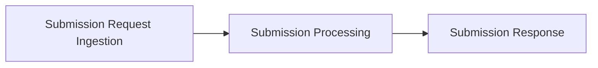
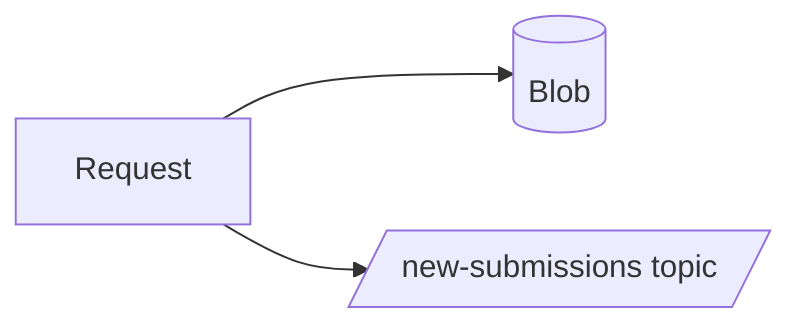
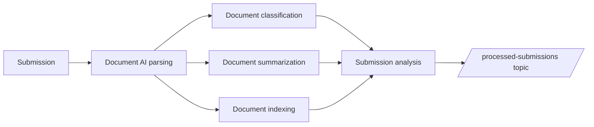

# Email Processing System Design

## Overview
This system processes incoming submission requests using AI to extract relevant information and generate potential responses. The system is built on Azure services with a focus on scalability, reliability, and maintainability.

## High-Level Flow
There are three subsequent processes that are coupled via messages. This is achieve isolation between phases so there might be completely different technologies used or even multiple paralel ways to implement those phases.



1. **Submission request ingestion**: User submits a request.
  - **Email**: Traditional email-based path where system must parse email body, sender and attachments.
  - **Client Web Application**: Browser-based form allowing users to create submissions.

In all cases high-level process flow is the following:
1. Store body and documents in Azure Blob Storage container (named with submission GUID)
2. Publishes message to Service Bus Topic with user ID, submission GUID, and document URLs

```json
{
  "submissionId": "123e4567-e89b-12d3-a456-426614174000",
  "userId": "user@example.com",
  "documentUrls": [
    "https://storage.blob.core.windows.net/submissions/123e4567-e89b-12d3-a456-426614174000/document1.pdf",
    "https://storage.blob.core.windows.net/submissions/123e4567-e89b-12d3-a456-426614174000/document2.docx"
  ],
  "submittedAt": "2025-07-07T14:30:00.123456Z"
}
```



2. **Submission processing**: AI system parse documents, extract information, indexes and store in database and use AI to analyze submission and prepare response
  - **Code-first choreography with Event Sourcing**: This approach uses event-driven architecture with event sourcing patterns to implement asynchronous processing through coordinated services. Extreme scale, resilience through loose coupling, audit trail through event history and best flexibility including edge computing, multi-cloud, hybrid.
  - **Code-first with orchestration framework**: TBD (eg. using Azure Durable Functions)
  - **Workflow orchestration with Logic Apps**: This approach leverages the orchestration capabilities of Azure Logic Apps to manage the entire process flow as a coordinated workflow. Simpler to understand and debug, but less flexible and Azure-specific.
  - **Agentic orchestration**: TBD (no predermined orchestration paths, everything just single reasoning LLM with tools)

In all cases high-level process flow is the following:
1. Document parsing using AI (PDF to Markdown conversion)
2. Document classification, metadata extraction and summarization using LLM
3. Document indexing and storage in database
4. AI agent analyzing submission leveraging tools (document search, web search, company APIs) and subordinate agents (specialized company policy agent)
5. Publishes message to Service Bus Topic with submission analysis results

```json
{
  "submissionId": "123e4567-e89b-12d3-a456-426614174000",
  "userId": "user@example.com",
  "submittedAt": "2025-07-07T14:30:00.123456Z",
  "processedAt": "2025-07-07T14:35:00.123456Z",
  "results": "Dear user, we have successfully processed your submission. The attached documents have been analyzed and classified. Here are the key findings:"
}
```



3. **Submission response**: AI system prepares response to user
  - **Email**: System sends email with response to user.
  - **Teams chat**: Message is sent to Teams chat with user. In future this should allow for discussion with customer service AI agent should user have follow-up questions.

## Submission request ingestion

### Email

### Client Web Application
Simple browser-based form allowing users to create submissions. Implemented in `client-web`.

## Submission Processing

### Common components

#### Search database - documents

**Index Name:** `documents-index` for code-first choreography with Event Sourcing and `documents-index-logicapp` for Logic Apps orchestration.

**Document Chunking Strategy:**
- Large documents are split into chunks of 2000 characters
- Chunks maintain context by including overlapping text (200-character overlap)
- Each chunk preserves metadata from the original document
- Vector embeddings generated using Azure OpenAI text-embedding-3-large model (3072 dimensions)

**Index Fields:**

| Field Name | Type | Properties | Description |
|------------|------|------------|-------------|
| `id` | Edm.String | Key, Retrievable | Unique identifier for the chunk (format: `{documentId}_{chunkIndex}`) |
| `content` | Edm.String | Searchable, Retrievable | Text content of the document chunk |
| `contentVector` | Collection(Edm.Single) | Searchable | Vector embedding of the content for semantic search |
| `documentId` | Edm.String | Filterable, Retrievable | ID of the source document in Cosmos DB |
| `documentUrl` | Edm.String | Filterable, Retrievable | Azure Blob Storage URL of the original document |
| `submissionId` | Edm.String | Filterable, Retrievable | Submission ID (enables filtering by submission) |
| `userId` | Edm.String | Filterable, Retrievable | User ID for security trimming |
| `chunkIndex` | Edm.Int32 | Filterable, Retrievable | Sequential index of the chunk within the document |
| `timestamp` | Edm.DateTimeOffset | Filterable, Retrievable | When the document was indexed |

**Security Trimming Implementation:**
- All search queries include filter: `userId eq '{currentUserId}'`
- Ensures users only see their own document content
- Applied at query time for real-time access control

**Search Capabilities:**
- **Full-text search:** Traditional keyword-based search across content
- **Semantic search:** Vector-based similarity search using contentVector field
- **Filtered search:** Combine text/semantic search with metadata filters
- **Faceted search:** Group results by submissionId, etc.

**Example Index Document:**
```json
{
  "id": "550e8400-e29b-41d4-a716-446655440000_0",
  "content": "Invoice #INV-2025-001\n\nBill To: Acme Corporation\n123 Business St\nSeattle, WA 98101\n\nDate: July 15, 2025\nDue Date: August 14, 2025\n\nDescription: Professional consulting services for Q2 2025 project implementation...",
  "contentVector": [0.1234, -0.5678, 0.9012, ...],
  "documentId": "550e8400-e29b-41d4-a716-446655440000",
  "documentUrl": "https://storage.blob.core.windows.net/submissions/123e4567-e89b-12d3-a456-426614174000/invoice.pdf",
  "submissionId": "123e4567-e89b-12d3-a456-426614174000",
  "userId": "user@example.com",
  "chunkIndex": 0,
  "timestamp": "2025-07-15T10:30:00Z"
}
```


#### Search database - policies

The platform must also expose a searchable knowledge base of internal policy documents (e.g., KYC, AML, underwriting policies) that live inside the repository folder `policies-docs`.  
Unlike user-uploaded documents, these files are processed by a **dedicated Azure AI Search indexer pipeline** that runs on a fixed schedule.

**Blob Storage Configuration**
- Storage account: `policiesstore`
- Container: `policy-docs`
- Build/CI step uploads the contents of `./policies-docs/**` into the container.
- Public access disabled; access via managed identity used by the indexer.

**Search Index:** `policies-index`

| Field Name      | Type                     | Properties                                   |
|-----------------|--------------------------|----------------------------------------------|
| `id`            | Edm.String               | Key, Retrievable                             |
| `content`       | Edm.String               | Searchable, Retrievable                      |
| `contentVector` | Collection(Edm.Single)   | Searchable (vector, 3072 dimensions)         |
| `fileName`      | Edm.String               | Filterable, Retrievable                      |
| `folderPath`    | Edm.String               | Filterable, Retrievable                      |
| `timestamp`     | Edm.DateTimeOffset       | Filterable, Retrievable                      |

Search capabilities mirror those of `documents-index`:
- Full-text search.
- Vector similarity search using `contentVector`.
- Semantic ranker enabled for hybrid search (`semanticConfiguration` set to `default`).

**Indexer:**
- Datasource type: Azure Blob Storage (`policy-docs` container).
- Skillset: Built-in document cracking + vectorization skill (Azure OpenAI `text-embedding-3-large`).
- Target index: `policies-index`.
- Schedule: **Daily** (`interval`: `P1D`), ensuring new or updated policies are picked up automatically.
- Failures routed to Azure Monitor logs for alerting.

**Security & Access Control**
- Because policy documents are internal, query filtering uses Azure AD role assignments rather than per-row `userId` trimming.
- Service-to-service queries originate from backend components (e.g., submission-analyzer) that use a managed identity with `policies-search-reader` role.


#### Company APIs Service
The Company APIs service provides business-specific functionality as HTTP endpoints that can be consumed by the submission-analyzer AI agent. This service generates mock data for demonstration purposes and exposes internal company information through RESTful APIs.

Implemented in `company-apis`.

##### 1. User Products API

**Endpoint:** `GET /api/v1/users/{userId}/products`

**Description:** Retrieves a list of products and services that the user is currently subscribed to or using.

**Parameters:**
- `userId` (path parameter, required): The user's unique identifier (email address)

**Response Schema:**
```json
{
  "userId": "string",
  "products": [
    {
      "productId": "string",
      "productName": "string",
      "productType": "string",
      "subscriptionStatus": "string",
      "subscriptionDate": "string",
      "monthlyFee": "number",
      "features": ["string"]
    }
  ],
  "totalActiveSubscriptions": "number",
  "totalMonthlyFees": "number"
}
```

**Example Request:**
```
GET /api/v1/users/john.doe@example.com/products
```

**Example Response:**
```json
{
  "userId": "john.doe@example.com",
  "products": [
    {
      "productId": "PRD-001",
      "productName": "Premium Business Account",
      "productType": "banking",
      "subscriptionStatus": "active",
      "subscriptionDate": "2024-01-15T00:00:00Z",
      "monthlyFee": 29.99,
      "features": ["unlimited_transactions", "priority_support", "advanced_analytics"]
    },
    {
      "productId": "PRD-002",
      "productName": "Investment Portfolio Management",
      "productType": "investment",
      "subscriptionStatus": "active",
      "subscriptionDate": "2024-03-20T00:00:00Z",
      "monthlyFee": 49.99,
      "features": ["portfolio_tracking", "risk_assessment", "automated_rebalancing"]
    }
  ],
  "totalActiveSubscriptions": 2,
  "totalMonthlyFees": 79.98
}
```

##### 2. User Financial Score API

**Endpoint:** `GET /api/v1/users/{userId}/financial-score`

**Description:** Returns the user's financial score based on various scoring methodologies.

**Parameters:**
- `userId` (path parameter, required): The user's unique identifier (email address)
- `scoreType` (query parameter, optional): Type of financial score to retrieve. Defaults to "composite"
  - `composite`: Overall financial health score (default)
  - `creditworthiness`: Credit-based scoring
  - `liquidity`: Cash flow and liquidity assessment
  - `stability`: Income and expense stability
  - `growth`: Financial growth trajectory

**Response Schema:**
```json
{
  "userId": "string",
  "scoreType": "string",
  "score": "number",
  "maxScore": "number",
  "scoreDate": "string",
  "factors": [
    {
      "factor": "string",
      "weight": "number",
      "score": "number",
      "description": "string"
    }
  ],
  "recommendations": ["string"]
}
```

**Example Request:**
```
GET /api/v1/users/john.doe@example.com/financial-score?scoreType=composite
```

**Example Response:**
```json
{
  "userId": "john.doe@example.com",
  "scoreType": "composite",
  "score": 82,
  "maxScore": 100,
  "scoreDate": "2025-07-11T00:00:00Z",
  "factors": [
    {
      "factor": "payment_history",
      "weight": 0.35,
      "score": 88,
      "description": "Consistent on-time payments with minimal late fees"
    },
    {
      "factor": "debt_to_income_ratio",
      "weight": 0.25,
      "score": 75,
      "description": "Moderate debt levels relative to income"
    },
    {
      "factor": "account_age",
      "weight": 0.20,
      "score": 90,
      "description": "Long-standing customer with mature account history"
    },
    {
      "factor": "cash_reserves",
      "weight": 0.20,
      "score": 78,
      "description": "Adequate emergency fund and savings balance"
    }
  ],
  "recommendations": [
    "Consider increasing monthly savings contributions",
    "Explore debt consolidation options to improve debt-to-income ratio"
  ]
}
```

##### 3. User Income API

**Endpoint:** `GET /api/v1/users/{userId}/income`

**Description:** Returns aggregated income data for the user over a specified time period.

**Parameters:**
- `userId` (path parameter, required): The user's unique identifier (email address)
- `startDate` (query parameter, required): Start date for income period (ISO 8601 format)
- `endDate` (query parameter, required): End date for income period (ISO 8601 format)
- `granularity` (query parameter, optional): Aggregation granularity. Defaults to "monthly"
  - `daily`: Daily income aggregation
  - `weekly`: Weekly income aggregation
  - `monthly`: Monthly income aggregation (default)
  - `yearly`: Yearly income aggregation

**Response Schema:**
```json
{
  "userId": "string",
  "startDate": "string",
  "endDate": "string",
  "granularity": "string",
  "totalIncome": "number",
  "averageIncome": "number",
  "incomeEntries": [
    {
      "period": "string",
      "totalAmount": "number",
      "sources": [
        {
          "sourceType": "string",
          "sourceName": "string",
          "amount": "number",
          "frequency": "string"
        }
      ]
    }
  ],
  "incomeGrowth": "number",
  "incomeStability": "number"
}
```

**Example Request:**
```
GET /api/v1/users/john.doe@example.com/income?startDate=2025-01-01&endDate=2025-07-31&granularity=monthly
```

**Example Response:**
```json
{
  "userId": "john.doe@example.com",
  "startDate": "2025-01-01T00:00:00Z",
  "endDate": "2025-07-31T23:59:59Z",
  "granularity": "monthly",
  "totalIncome": 42000.00,
  "averageIncome": 6000.00,
  "incomeEntries": [
    {
      "period": "2025-01",
      "totalAmount": 6200.00,
      "sources": [
        {
          "sourceType": "salary",
          "sourceName": "Primary Employer",
          "amount": 5500.00,
          "frequency": "monthly"
        },
        {
          "sourceType": "freelance",
          "sourceName": "Consulting Work",
          "amount": 700.00,
          "frequency": "irregular"
        }
      ]
    },
    {
      "period": "2025-02",
      "totalAmount": 5800.00,
      "sources": [
        {
          "sourceType": "salary",
          "sourceName": "Primary Employer",
          "amount": 5500.00,
          "frequency": "monthly"
        },
        {
          "sourceType": "investment",
          "sourceName": "Dividend Income",
          "amount": 300.00,
          "frequency": "quarterly"
        }
      ]
    }
  ],
  "incomeGrowth": 0.05,
  "incomeStability": 0.88
}
```

##### Error Handling

All endpoints follow consistent error response format:

```json
{
  "error": {
    "code": "string",
    "message": "string",
    "details": "string"
  }
}
```

Common error codes:
- `USER_NOT_FOUND`: User ID does not exist in the system
- `INVALID_DATE_RANGE`: Invalid or malformed date parameters
- `INVALID_SCORE_TYPE`: Unsupported financial score type
- `INVALID_GRANULARITY`: Unsupported aggregation granularity
- `INTERNAL_ERROR`: Server-side processing error

#### Agent Capabilities

##### RAG (Retrieval-Augmented Generation) with Security Trimming

**Purpose:** Search and retrieve relevant information from the user's document history and previous conversations.

**Implementation:**
- Queries Azure AI Search `documents-index` containing all user document chunks
- Applies security trimming by filtering results where `userId == currentUser`
- Supports both full-text and semantic search using content vectors
- Retrieves contextually relevant document chunks with source metadata
- Provides document context to the AI agent for informed decision making

**Search Query Examples:**
```
// Semantic search with security trimming
{
  "search": "invoice payment terms",
  "vector": { "value": [0.1, 0.2, ...], "fields": "contentVector" },
  "filter": "userId eq 'user@example.com'",
  "select": "content,documentUrl,submissionId,documentType,chunkIndex"
}

// Filtered search by submission
{
  "search": "*",
  "filter": "userId eq 'user@example.com' and submissionId eq '123e4567-e89b-12d3-a456-426614174000'",
  "select": "content,documentUrl,submissionId"
}
```

**Retrieved Context Format:**
- Document chunk content with source attribution
- Metadata including documentUrl, submissionId
- Chunk index for reconstructing document structure if needed

**Security Features:**
- Row-level security through userId filtering
- Encrypted search queries and results
- Audit logging of all search operations
- Access control validation for each query

##### Web Search for Entity Investigation

**Purpose:** Investigate external entities mentioned in documents (e.g., invoice vendors, business partners, organizations).

**Implementation:**
- Integrates with Azure Cognitive Search Web API or Bing Search API
- Automatically extracts entity names from documents (companies, vendors, organizations)
- Performs targeted web searches to gather public information
- Analyzes search results to identify potential risks or opportunities

**Use Cases:**
- Vendor verification and reputation checking
- Business legitimacy validation
- Risk assessment for new business relationships
- Market intelligence gathering

##### Company APIs Integration

**Purpose:** Access internal company data and business logic through standardized APIs.

**Implementation:**
- HTTP client integration with company-apis service
- Automatic user context propagation for personalized data retrieval
- Structured data integration into agent reasoning process
- Error handling and fallback mechanisms

**Available Tools:**
- User product portfolio analysis
- Financial health assessment
- Income trend analysis
- Risk scoring and profiling

##### Analysis Outputs

The AI agent generates comprehensive analysis results including:

1. **Completeness Assessment**
   - Document coverage analysis
   - Missing information identification
   - Compliance requirement checking

2. **Risk Analysis**
   - Vendor/entity risk evaluation
   - Financial risk assessment
   - Operational risk identification

3. **Recommendation Generation**
   - Next steps for submission processing
   - Additional documentation requirements
   - Potential opportunities or concerns

4. **Compliance Validation**
   - Regulatory requirement verification
   - Policy adherence checking
   - Audit trail generation

### Code-first choreography with Event Sourcing


#### Services
1. **submission-intake**
   - Listens to Service Bus topic for new submissions
   - Creates submission record in submissions container
   - Emits `SubmissionCreated` event with document URLs
   - Emits `DocumentUploadedEvent` for each document

2. **submission-trigger** 
   - Listens to `SubmissionCreated`, `DocumentClassifiedEvent`, `DocumentIndexedEvent`, `DocumentDataExtractedEvent`.  
   - Maintains an Cosmos DB projection of per-submission per-document status.  
   - When every document in the submission is processed by all three docproc services, emits `SubmissionPreparationCompletedEvent`.  

3. **docproc-parser-foundry**
   - Listens to Change Feed for `DocumentUploadedEvent`
   - Processes documents using Azure Document Intelligence to convert to Markdown
   - Stores content in documents container
   - Emits `DocumentContentExtractedEvent`

4. **docproc-classifier**
   - Listens to Change Feed for `DocumentContentExtractedEvent`
   - Uses LLM to classify document type and generate summary
   - Updates document record with type and summary
   - Update submission record with document type
   - Emits `DocumentClassifiedEvent`

5. **docproc-search-indexer**
   - Listens to Change Feed for `DocumentContentExtractedEvent`
   - Ingests document content into Azure AI Search with metadata
   - Includes userId as filtering metadata for security trimming
   - Emits `DocumentIndexedEvent`

6. **docproc-data-extractor**
   - Listens to Change Feed for `DocumentContentExtractedEvent`
   - Uses LLM to extract structured information
   - Updates document record with extractedData
   - Emits `DocumentDataExtractedEvent`

7. **submission-analyzer**
   - Listens to Change Feed for `SubmissionPreparationCompletedEvent`
   - AI Foundry agent with advanced capabilities:
     - RAG search into Azure AI Search for user documents and previous conversations (with security trimming by userId)
     - Web search for investigating entities (e.g., invoice vendors, companies)
     - Integration with company-apis for internal business logic
   - Tracks completion of all document processing steps
   - Performs comprehensive AI analysis of complete submission
   - Updates submission record with evaluation results
   - Emits `SubmissionAnalysisCompleteEvent`
  

#### Persistent storage model (Cosmos DB)

**Event Store:** Cosmos DB container with Change Feed enabled
- Container: `events`
- Partition Key: `submissionId`
- Events are immutable and append-only

**Document Store:** Cosmos DB container for processed document results
- Container: `documents` 
- Partition Key: `submissionId` (groups documents by submission)
- Document ID: Generated GUID for each document record
- Type: `type` field to indicate document type and it is enum: `invoice`, `contract`, `bankStatement`, `submissionNotes`, `other`, 
- Schema:
  ```json
  {
    "id": "550e8400-e29b-41d4-a716-446655440000",
    "documentUrl": "https://storage.blob.core.windows.net/submission-guid/document1.pdf",
    "submissionId": "submission-guid",
    "userId": "user@example.com",
    "content": "Full text content extracted from document using Azure Document Intelligence...",
    "type": "invoice",
    "summary": "AI-generated summary of document content...",
    "extractedData": {
      "invoiceNumber": "INV-2025-001",
      "totalAmount": 1250.00,
      "currency": "USD",
      "dueDate": "2025-08-07",
      "vendor": "Acme Corp"
    },
    "firstProcessedAt": "2025-07-07T10:00:00Z",
    "lastProcessedAt": "2025-07-07T10:05:00Z"
  }
  ```
  
  Note: Cosmos DB automatically adds internal fields like `_rid`, `_self`, `_etag`, `_attachments`, and `_ts` which should be ignored by client applications when parsing the document model.

**Submission Store:** Cosmos DB container for submission records
- Container: `submissions`
- Partition Key: `userId`
- Schema:
  ```json
  {
    "id": "submission-guid",
    "submissionId": "submission-guid", 
    "userId": "user@example.com",
    "submittedAt": "2025-07-07T10:00:00Z",
    "userMessage": "Please review the attached invoices and contract documents for approval. Let me know if you need any additional information.",
    "documents": [
      {
        "documentUrl": "https://storage.blob.core.windows.net/submission-guid/document1.pdf",
        "type": "invoice"
      },
      {
        "documentUrl": "https://storage.blob.core.windows.net/submission-guid/document2.docx",
        "type": "contract"
      }
    ],
    "evaluationResults": {
      "completeness": 0.85,
      "recommendations": ["Request additional documentation for item X"],
      "issues": [],
      "analysisTimestamp": "2025-07-07T10:15:00Z"
    }
  }
  ```

#### Event Formats

**SubmissionCreated**
```json
{
  "id": "uuid",
  "eventType": "SubmissionCreated",
  "submissionId": "submission-guid",
  "userId": "user@example.com",
  "timestamp": "2025-07-07T10:00:00Z",
  "data": {
    "documentUrls": [
      "https://storage.blob.core.windows.net/submission-guid/document1.pdf",
      "https://storage.blob.core.windows.net/submission-guid/document2.docx"
    ],
    "containerName": "submission-guid"
  }
}
```

**DocumentUploadedEvent**
```json
{
  "id": "uuid",
  "eventType": "DocumentUploadedEvent", 
  "submissionId": "submission-guid",
  "userId": "user@example.com",
  "timestamp": "2025-07-07T10:00:00Z",
  "data": {
    "documentUrl": "https://storage.blob.core.windows.net/submission-guid/document1.pdf",
    "documentId": "550e8400-e29b-41d4-a716-446655440000"
  }
}
```

**DocumentContentExtractedEvent**
```json
{
  "id": "uuid",
  "eventType": "DocumentContentExtractedEvent",
  "submissionId": "submission-guid",
  "userId": "user@example.com", 
  "timestamp": "2025-07-07T10:02:00Z",
  "data": {
    "documentUrl": "https://storage.blob.core.windows.net/submission-guid/document1.pdf",
    "documentId": "550e8400-e29b-41d4-a716-446655440000",
    "contentLength": 15000,
    "success": true
  }
}
```

**DocumentClassifiedEvent**
```json
{
  "id": "uuid",
  "eventType": "DocumentClassifiedEvent",
  "submissionId": "submission-guid",
  "userId": "user@example.com", 
  "timestamp": "2025-07-07T10:05:00Z",
  "data": {
    "documentUrl": "https://storage.blob.core.windows.net/submission-guid/document1.pdf",
    "documentId": "550e8400-e29b-41d4-a716-446655440000",
    "documentType": "invoice",
    "success": true
  }
}
```

**DocumentIndexedEvent**
```json
{
  "id": "uuid",
  "eventType": "DocumentIndexedEvent",
  "submissionId": "submission-guid",
  "userId": "user@example.com", 
  "timestamp": "2025-07-07T10:04:00Z",
  "data": {
    "documentUrl": "https://storage.blob.core.windows.net/submission-guid/document1.pdf",
    "documentId": "550e8400-e29b-41d4-a716-446655440000",
    "searchIndexName": "documents-index",
    "success": true
  }
}
```

**DocumentDataExtractedEvent**
```json
{
  "id": "uuid",
  "eventType": "DocumentDataExtractedEvent",
  "submissionId": "submission-guid",
  "userId": "user@example.com", 
  "timestamp": "2025-07-07T10:06:00Z",
  "data": {
    "documentUrl": "https://storage.blob.core.windows.net/submission-guid/document1.pdf",
    "documentId": "550e8400-e29b-41d4-a716-446655440000",
    "success": true
  }
}
```

**DocumentProcessedEvent**
```json
{
  "id": "uuid",
  "eventType": "DocumentProcessedEvent",
  "submissionId": "submission-guid",
  "userId": "user@example.com", 
  "timestamp": "2025-07-07T10:07:00Z",
  "data": {
    "documentUrl": "https://storage.blob.core.windows.net/submission-guid/document1.pdf",
    "processingStepsComplete": ["classification", "dataExtraction", "indexing"],
    "success": true
  }
}
```

**SubmissionAnalysisCompleteEvent**
```json
{
  "id": "uuid",
  "eventType": "SubmissionAnalysisCompleteEvent",
  "submissionId": "submission-guid",
  "userId": "user@example.com",
  "timestamp": "2025-07-07T10:15:00Z",
  "data": {
    "analysisResults": {
      "completeness": 0.85,
      "recommendations": ["Request additional documentation for item X"],
      "issues": []
    }
  }
}
```

**SubmissionPreparationCompletedEvent**
```json
{
  "id": "uuid",
  "eventType": "SubmissionPreparationCompletedEvent",
  "submissionId": "submission-guid",
  "userId": "user@example.com",
  "timestamp": "2025-07-07T10:10:00Z",
  "data": {
    "documentsProcessed": 3
  }
}
```

#### Service Scaling and High Availability

##### Change Feed Distribution Strategy
Not implemented in MVP, but planned for production.

**FeedRange-Based Parallelization:**
- Each Cosmos DB container is internally partitioned into physical partitions
- Each physical partition has a corresponding FeedRange that represents a range of partition keys
- Multiple service replicas can process different FeedRanges simultaneously
- No overlap between FeedRanges ensures no duplicate processing

**Scaling Architecture:**
```
┌─────────────────────────────────────────────────────────────┐
│ Cosmos DB Container (events)                                │
│ ┌─────────────┬─────────────┬─────────────┬─────────────┐   │
│ │ FeedRange 0 │ FeedRange 1 │ FeedRange 2 │ FeedRange 3 │   │
│ │ Partition   │ Partition   │ Partition   │ Partition   │   │
│ │ 0000-3FFF   │ 4000-7FFF   │ 8000-BFFF   │ C000-FFFF   │   │
│ └─────────────┴─────────────┴─────────────┴─────────────┘   │
└─────────────────────────────────────────────────────────────┘
         │              │              │              │
         ▼              ▼              ▼              ▼
┌─────────────┐ ┌─────────────┐ ┌─────────────┐ ┌─────────────┐
│   Replica   │ │   Replica   │ │   Replica   │ │   Replica   │
│      A      │ │      B      │ │      C      │ │      D      │
│             │ │             │ │             │ │             │
│ Processes   │ │ Processes   │ │ Processes   │ │ Processes   │
│ FeedRange 0 │ │ FeedRange 1 │ │ FeedRange 2 │ │ FeedRange 3 │
└─────────────┘ └─────────────┘ └─────────────┘ └─────────────┘
```

##### Coordination and Leadership

**Leader Election Pattern:**
- One replica becomes the "leader" responsible for FeedRange assignment coordination
- Leader maintains mapping of replicas to FeedRanges in Azure Table Storage
- Leader monitors replica health through heartbeat mechanism
- Automatic rebalancing when replicas join or leave the cluster

**Assignment Distribution:**
```
Azure Table Storage - FeedRange Assignments
┌──────────────────────────────────────────────────────────┐
│ Assignments Table                                        │
│ ┌─────────────┬─────────────────────────────────────────┐ │
│ │ Replica ID  │ Assigned FeedRanges                     │ │
│ ├─────────────┼─────────────────────────────────────────┤ │
│ │ replica-a   │ ["feedrange-0", "feedrange-1"]          │ │
│ │ replica-b   │ ["feedrange-2"]                         │ │
│ │ replica-c   │ ["feedrange-3"]                         │ │
│ └─────────────┴─────────────────────────────────────────┘ │
│                                                          │
│ Replicas Table (Heartbeats)                             │
│ ┌─────────────┬─────────────────────────────────────────┐ │
│ │ Replica ID  │ Last Heartbeat                          │ │
│ ├─────────────┼─────────────────────────────────────────┤ │
│ │ replica-a   │ 2025-07-09T10:15:30Z                    │ │
│ │ replica-b   │ 2025-07-09T10:15:28Z                    │ │
│ │ replica-c   │ 2025-07-09T10:15:32Z                    │ │
│ └─────────────┴─────────────────────────────────────────┘ │
└──────────────────────────────────────────────────────────┘
```

### Code-first with orchestration framework
Azure Durable Functions offer code-first orchestration capabilities. We will reuse all data structure and CosmosDB containers for submission and documents storage, but we will have no events and event store between steps because orchestration framework will handle state management and execution flow.

### Workflow Orchestration with Logic Apps

### Agentic orchestration

## Submission response

### Email
System sends email with response to user.

### Teams chat
Message is sent to Teams chat with user. In future this should allow for discussion with customer service AI agent should user have follow-up questions.


